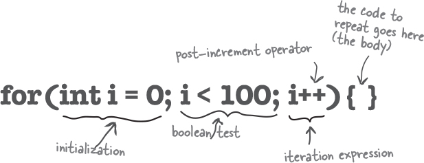
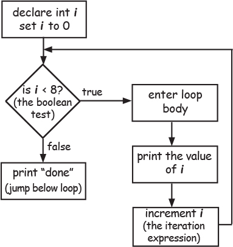

# Head First Java
## Steps to creating classes

1. Figure out what the class is supposed to do.

2. List the instance variables and methods.

3. Write prepcode for the methods. (You’ll see this in just a moment.)

4. Write test code for the methods.

5. Implement the class.

6. Test the methods.

7. Debug and reimplement as needed.

## For loops



### What it means in plain English: “Repeat 100 times.”

How the compiler sees it:

* create a variable i and set it to 0.

* repeat while i is less than 100.

* at the end of each loop iteration, add 1 to i

**Part One: initialization**

Use this part to declare and initialize a variable to use within the loop body. You’ll most often use this variable as a counter. You can actually initialize more than one variable here, but we’ll get to that later in the book.

**Part Two: boolean test**

This is where the conditional test goes. Whatever’s in there, it must resolve to a boolean value (you know, true or false). You can have a test, like (x >= 4), or you can even invoke a method that returns a boolean.

**Part Three: iteration expression**

In this part, put one or more things you want to happen with each trip through the loop. Keep in mind that this stuff happens at the end of each loop.

Another Example:

```
for (int i = 0; i < 8; i++) {
System.out.println(i);
}
System.out.println(“done”);
```
